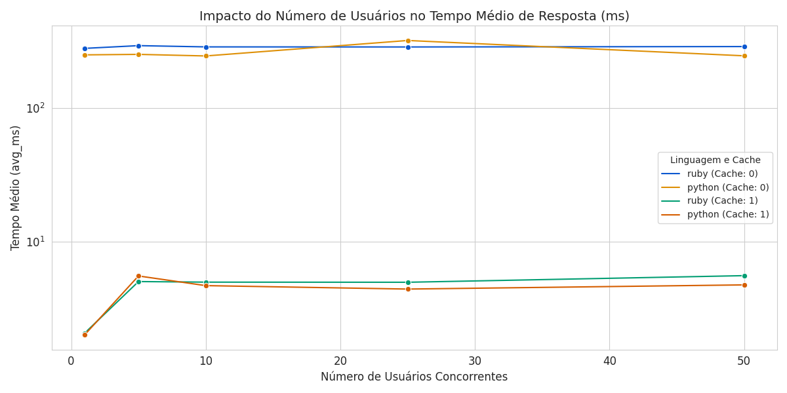

# Realização de Testes de Desempenho com a Aplicação Link Extractor

## 1. Descrição do Trabalho
Este trabalho consiste em um benchmark de performance do **LinkExtractor**, comparando implementações em diferentes linguagens e o impacto do uso de cache distribuído.

## 2. Cenários Avaliados
Os testes foram baseados nos steps do repositório original, com a inclusão de um cenário customizado:

*   **[Cenário 1](linkextractor/step3) (Python s/ Cache):** Implementação baseada no **Step 3** (Flask).
*   **[Cenário 2](linkextractor/step5) (Python c/ Cache):** Implementação baseada no **Step 5** (Flask + Redis).
*   **[Cenário 3](linkextractor/step6) (Ruby c/ Cache):** Implementação baseada no **Step 6** (Sinatra + Redis).
*   **[Cenário 4](linkextractor/ruby_sem_redis) (Ruby s/ Cache):** Versão customizada do Step 6, com a remoção manual do suporte ao Redis para isolar a performance da linguagem.

## 3. Metodologia de Teste
A geração de carga foi realizada via **Locust** em container Docker, orquestrada por um script de automação [`run_scenarios.sh`](locust/run_scenarios.sh).

### [Configuração do Locust](locust/locustfile.py):
*   **Task:** Cada usuário percorre sequencialmente uma lista de [10 URLs](urls).
*   **Contagem de Requisições:** Devido ao loop interno, o número total de requisições registradas é sempre o dobro do número de usuários por ciclo de coleta (considerando 2 execuções completas por usuário).
*   **Escalabilidade:** Testes realizados com 1, 5, 10, 25 e 50 usuários simultâneos.

## 4. Processamento de Dados
O script [build_report.py](locust/build_report.py) executa o pós-processamento dos dados, validando a integridade do summary.csv e padronizando as métricas para análise. Ele converte o status do cache para formato binário, normaliza as nomenclaturas das linguagens e filtra colunas essenciais de latência e RPS, gerando um relatório consolidado em report.csv.

## 5. Resultados e Conclusões
*   **Eficiência do Cache:** A introdução do Redis (Steps 5 e 6) reduziu a latência média de **~280ms** para **~4ms**, um ganho de performance superior a 98%.
*   **Estabilidade do Host:** O notebook suportou o aumento de carga sem degradação significativa no tempo de resposta médio até 50 usuários.
*   **Comparativo de Linguagem:** Em cenários sem cache, o Python (Flask) apresentou tempos de resposta levemente mais consistentes que o Ruby (Sinatra) sob concorrência.

---
